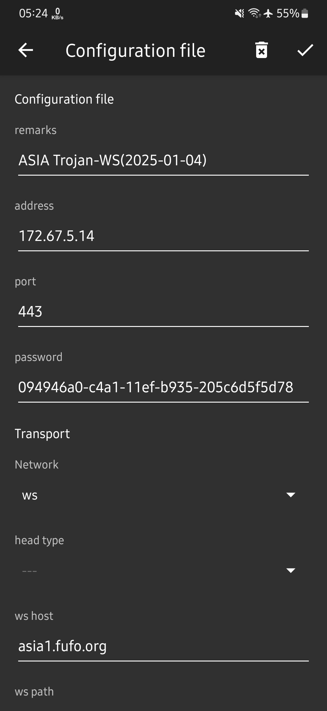
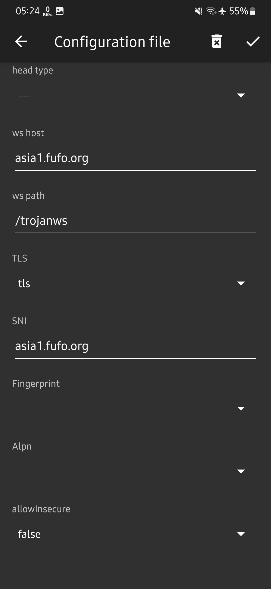

# 🛠️ Metode Websocket

### Setting di aplikasi v2ray

<figure><figcaption><p>ss 1</p></figcaption></figure>

<figure><figcaption><p>ss 2</p></figcaption></figure>

***

### Setting di OpenClash OpenWRT


```yaml
proxies:
  - name: versi Trojan GO/WS (CDN)
    server: 172.67.5.14 #isi_dengan_bug_ip/host
    port: 443
    type: trojan
    password: PASSWORD
    network: ws
    sni: asia1.fufo.org #isi_sesuai_domain_akun(SERVER.COM)
    skip-cert-verify: true
    udp: true
    ws-opts:
     path: /trojanws #isi_sesuai_path_akun
      headers:
          Host: asia1.fufo.org #isi_sesuai_domain_akun(SERVER.COM)
```


***


#### Buat akun gratis di:

[Howdy](https://www.fastssh.com/page/create-obfs-account/server/3/obfs-asia-sg/)

Lalu pilih:

<mark style="color:orange;">TROJAN + WS + TLS(GO)</mark>

#### Aplikasi V2ray

Download dari :

[Github](https://github.com/2dust/v2rayNG/tags) atau [Playstore](https://play.google.com/store/apps/details?id=com.v2ray.ang)

***

#### Source

Lebih lengkap lihat di [Blog VPNGame](https://blog.vpngame.com/openwrt/kumpulan-daftar-format-akun-untuk-openclash/)


***
