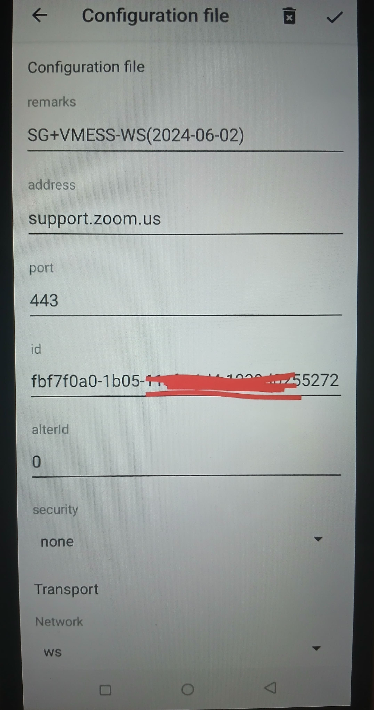
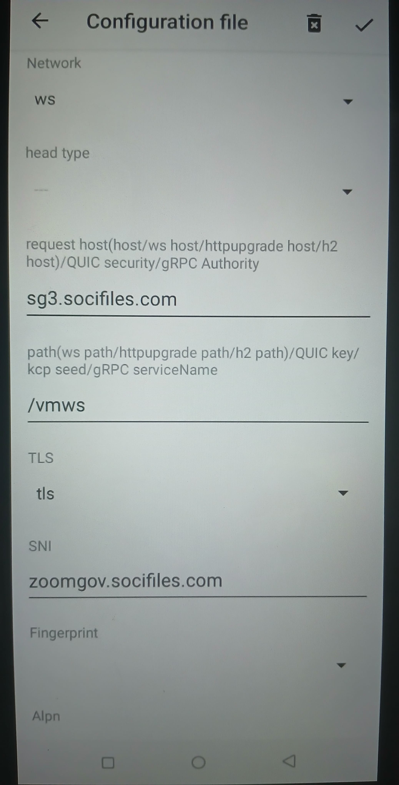

# 🛠️ Metode Willcard

### Setting Metode Willcard aplikasi v2ray

<figure><figcaption><p>ss 1</p></figcaption></figure>

<figure><figcaption><p>ss 2</p></figcaption></figure>

***

### Setting di OpenClash


```yaml
proxies:
  - name: SG+VMESS-WS(2024-06-02)
    server: support.zoom.us
    port: 443
    type: vmess
    uuid: fbf7f0a0-1605-1lef-ald4-1439c8260276
    alterId: 0
    cipher: auto
    tls: true
    skip-cert-verify: true
    servername: zoomgov.socifiles.com #bug.namaServer
    network: WS
    ws-opts:
      path: /vmws
      headers:
      Host: sg3.socifiles.com
      udp: true
```


***


#### Server yang support BIZ XL

Buat akun di:

[Howdy](https://howdy.id/xray-vmess-vless-trojan/)

Lalu pilih:

<mark style="color:orange;">Vmess + WS + TLS/No TLS</mark>


***
