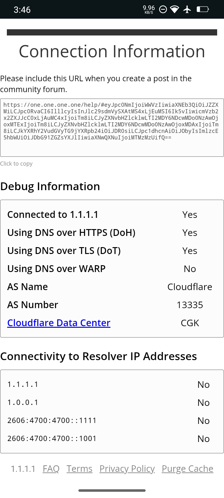

# 📝 DNS Lain

<details>

<summary>1) Cloudflare DNS Public</summary>

#### Versi Hostname/Resolver

```host
1dot1dot1dot1.cloudflare-dns.com
```

```host
one.one.one.one
```

```host
security.cloudflare-dns.com
```

```host
family.cloudflare-dns.com
```

#### Versi IP

```ip
1.1.1.1
```

```ip
1.0.0.1
```

```ip
1.1.1.2
```

```ip
1.0.0.2
```

```ip
1.1.1.3
```

```ip
1.0.0.3
```

***

Cek koneksi-nya di [https://one.one.one.one/help](https://one.one.one.one/help)



`Source:` https://developers.cloudflare.com/1.1.1.1/setup/android/#android-11-or-later

</details>

<details>

<summary>2) ControlD DNS Public</summary>

```dns-over-tls/doq
p2.freedns.controld.com
```

```dns-over-tls/doq
uncensored.freedns.controld.com
```

```dns-over-tls/doq
x-oisd.freedns.controld.com
```

```dns-over-tls/doq
x-goodbyeads.freedns.controld.com
```

Cek koneksi-nya di [https://one.one.one.one/help](https://one.one.one.one/help)

`Source:` https://controld.com/free-dns

</details>

***
