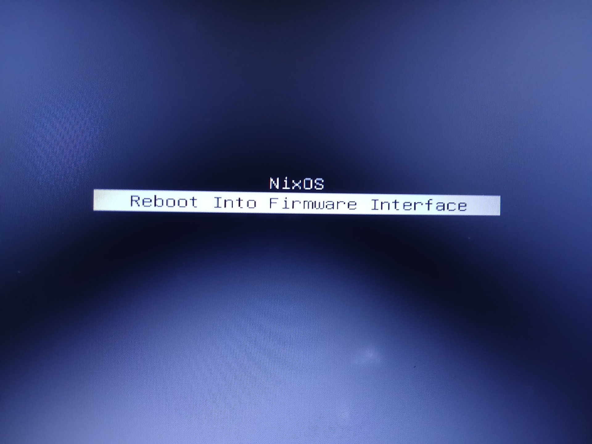
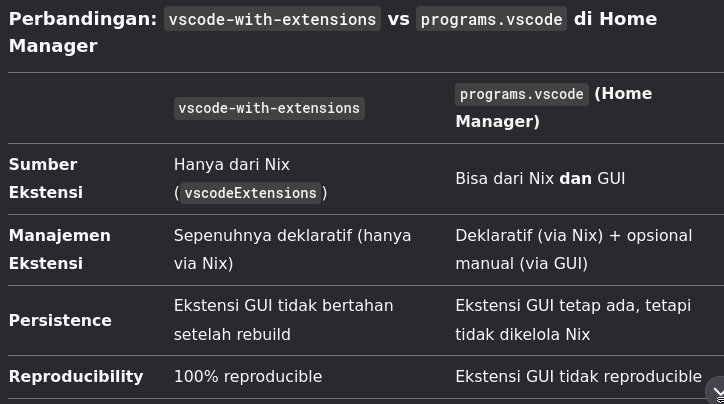
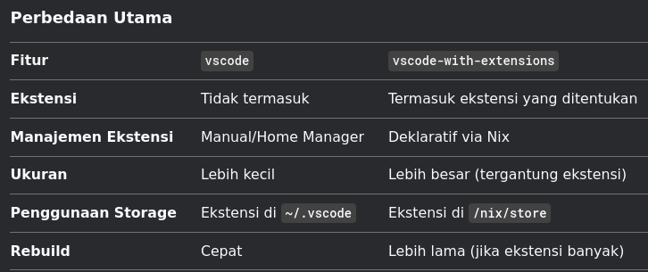

# 📝 NixOS Config

## A) install packages unsfree or paket yang memiliki opsi berbayar

#### 1) buat folder nixpkgs dan file **config.nix**

<details>

<summary>CODE</summary>

```bash
mkdir ~/.config/nixpkgs
nano config.nix
```

#### 2) copy dan tempel di **config.nix**

```nix
{
 allowUnsfree = 1;
 permittedInsecurePackages = [
 "openssl-1.1.1w"
 ];
}
```

</details>

## B) Install package with NixOS Conf

#### 1) edit file di /etc/nixos/configuration.nix

<details>

<summary>CODE</summary>

```
sudo nano /etc/nixos/configuration.nix
```

#### 2) add some syntax

<pre class="language-nix"><code class="lang-nix"><strong>  environment.systemPackages = [
</strong>    pkgs.rocmPackages_5.rpp
  ];
</code></pre>

3\) rebuild config

```bash
sudo nixos-rebuild switch
```

</details>

***

## C) Notes

* Versi lama dari sistem Anda akan disimpan di /nix/store/-system-previous.
* Versi baru (yang baru saja dibangun) akan disalin ke /nix/store/-system-new.

<details>

<summary>CODE</summary>

#### 1) Rollback ke versi lama

```bash
sudo nixos-rebuild switch --rollback
```

#### 2) Clear cache build not use

```bash
sudo nix-collect-garbage
```

#### 3) Check list generations from nix-rebuild

```bash
sudo nix-env --list-generations --profile /nix/var/nix/profiles/system
```

#### 4) Remove old generations

```bash
sudo nix-env --delete-generations <nomer_generasi>
```

#### 5) Hapus semua generasi kecuali yg sedang digunakan

```bash
sudo nix-env --delete-generations old
```

#### 6) After remove some generations, **clear all cache & build version** / clear Nix Store using:

```bash
sudo nix-collect-garbage -d
```

***

#### 7) Update Bootloader entry list

```bash
sudo nixos-rebuild boot
```

Before


After



</details>

***

## D) Command edit configuration.nix with codium - SuperUSER

```
sudo codium --no-sandbox --user-data-dir=/tmp/vscodium-data /etc/nixos/configuration.nix
```

***

## E) Instalasi home-manager

Ikuti step 1-3 di [https://nix-community.github.io/home-manager/index.xhtml#sec-install-standalone](https://nix-community.github.io/home-manager/index.xhtml#sec-install-standalone)

Kemudian edit di

```bash
~/.config/home-manager/home.nix
```

***

<details>

<summary><mark style="color:blue;"><strong>vscode-with-extensions vs vscode | nixpkgs</strong></mark></summary>

`jadi vscode-with-extensions tidak bisa menginstal extension lewat GUI-nya, melainkan hanya bisa lewat konfigurasi config.nix?`

Tepat sekali! Jika Anda menggunakan vscode-with-extensions, ekstensi yang terinstal hanya bisa dikelola melalui Nix (di config.nix). Ini karena:

#### Mekanisme vscode-with-extensions

1. Paket ini adalah wrapper yang menggabungkan VS Code dengan ekstensi tertentu ke dalam satu derivasi Nix.
2. Ekstensi yang ditambahkan melalui `vscode-with-extensions` akan tertanam di `/nix/store` dan tidak bisa diubah/diupdate melalui GUI.
3. Jika Anda mencoba menginstal/menghapus ekstensi via GUI:

* Perubahan tidak akan bertahan setelah rebuild Nix/Home Manager.
* Ekstensi yang diinstal via GUI akan disimpan di \~/.vscode/extensions, tetapi tertimpa/diabaikan saat konfigurasi Nix diterapkan ulang.





`Source:` https://chat.deepseek.com/a/chat/s/55a4d7cb-2934-46fd-9aa7-d0a30488b820

</details>

***

`References:`

1. Medium. https://medium.com/thelinux/how-to-remove-old-generations-of-nixos-b072db4ad01e
2. Github. https://nix-community.github.io/home-manager/index.xhtml#sec-install-standalone

***
